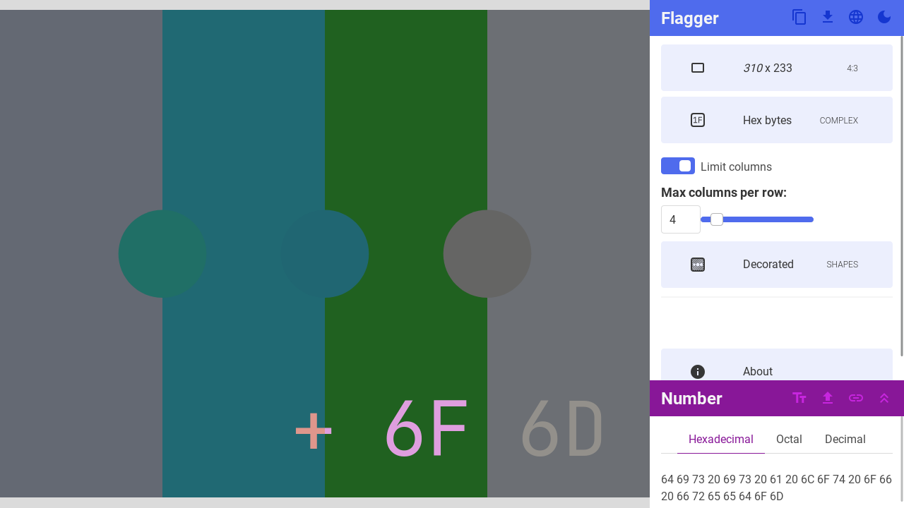

# Freedom Flagger


[](https://vuejs.org/)
[](https://bulma.io/)
[](https://sass-lang.com/)

Stenographic flag generator, inspired by free speech flags related to "illegal numbers".



## Building

Install dependencies:

```
npm install
```

Run build script:

```
npm run build
```

## Testing

Run test script:

```
npm test
```

## Running locally

Run live server script:

```
npm run dev
```

---

[Generated with `vue` template using Vite.](https://vitejs.dev/guide/)
